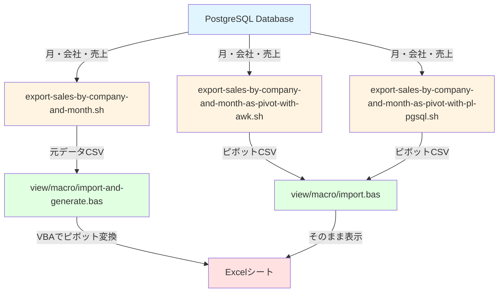
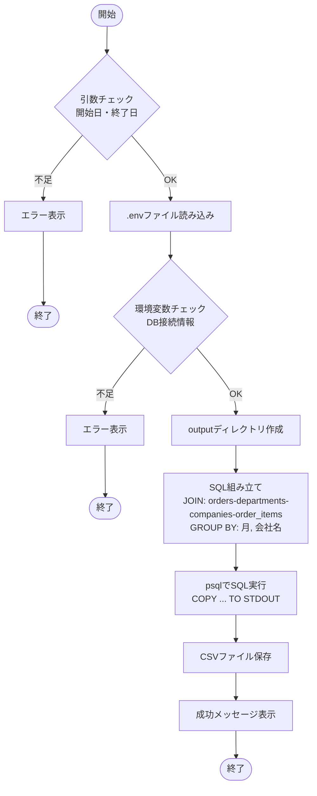
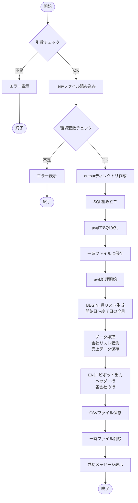
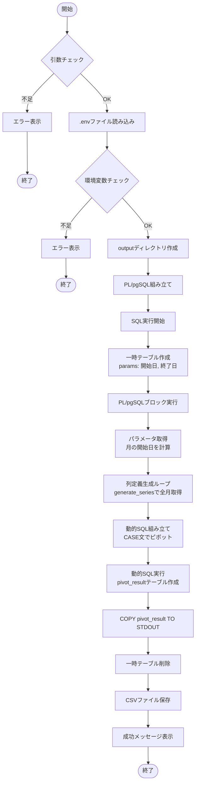
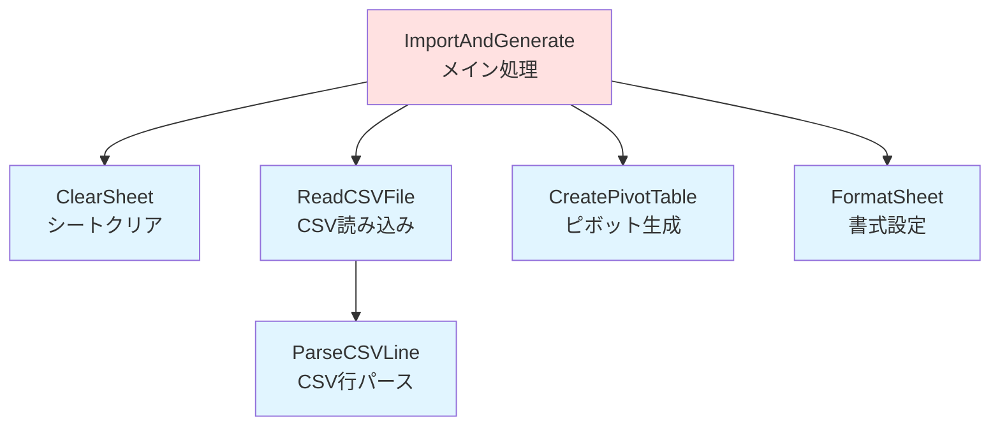
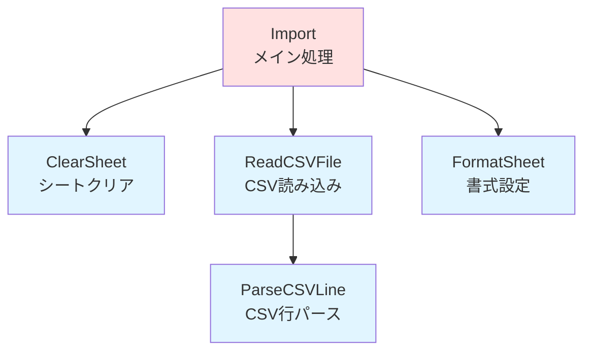
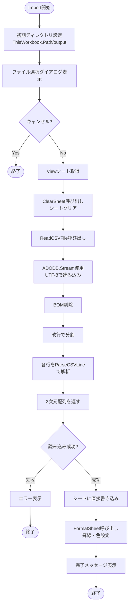

```mermaid
flowchart TD
    Start([ImportAndGenerate開始]) --> SetDir[初期ディレクトリ設定<br/>ThisWorkbook.Path/output]
    SetDir --> ShowDialog[ファイル選択ダイアログ表示]
    ShowDialog --> CheckCancel{キャンセル?}
    CheckCancel -->|Yes| End1([終了])

    CheckCancel -->|No| GetSheet[Viewシート取得]
    GetSheet --> Clear[ClearSheet呼び出し<br/>シートクリア]

    Clear --> Read[ReadCSVFile呼び出し]
    Read --> ReadStart[ADODB.Stream使用<br/>UTF-8で読み込み]
    ReadStart --> RemoveBOM[BOM削除]
    RemoveBOM --> SplitLines[改行で分割]
    SplitLines --> ParseLoop[各行をParseCSVLine<br/>で解析]
    ParseLoop --> ReadEnd[2次元配列を返す]

    ReadEnd --> CheckRead{読み込み成功?}
    CheckRead -->|失敗| Error1[エラー表示]
    Error1 --> End2([終了])

    CheckRead -->|成功| CreatePivot[CreatePivotTable呼び出し]
    CreatePivot --> CollectUnique[会社名・月を<br/>Collectionに収集]
    CollectUnique --> BuildDict[Dictionaryに<br/>key=会社&#124;月<br/>value=売上<br/>を保存]
    BuildDict --> BuildArray[ピボット配列構築<br/>ヘッダー + データ行]
    BuildArray --> PivotEnd[配列を返す]

    PivotEnd --> CheckPivot{生成成功?}
    CheckPivot -->|失敗| Error2[エラー表示]
    Error2 --> End3([終了])

    CheckPivot -->|成功| WriteSheet[シートにデータ書き込み]
    WriteSheet --> Format[FormatSheet呼び出し<br/>罫線・色設定]
    Format --> ShowSuccess[完了メッセージ表示]
    ShowSuccess --> End4([終了])
```

# 売上ピボットテーブル生成システム

## 目標

PostgreSQLデータベースから会社と月ごとの売上データを抽出し、ピボットテーブル形式でExcelに表示するシステムです。

### 書き出すデータ

以下のテーブルを結合して売上データを集計します:

- **orders**: 注文情報（注文日、部署ID）
- **departments**: 部署情報（会社ID）
- **companies**: 会社情報（会社名）
- **order_items**: 注文明細（数量、単価）

集計結果:
- **月** (YYYY-MM形式)
- **会社名**
- **売上金額** (数量 × 単価の合計)

### ピボットテーブル

行に会社名、列に月を配置し、各セルに売上金額を表示する形式です。

**元データ形式:**
```
月,会社名,売上金額
2024-01,A社,100000
2024-01,B社,200000
2024-02,A社,150000
```

**ピボット形式:**
```
会社名,2024-01,2024-02
A社,100000,150000
B社,200000,0
```

## 方針

ピボットテーブルの生成タイミングによって3つのアプローチがあります。

### 1. 書き出し時にピボットテーブルを作る

#### (a) awkを使う方法
PostgreSQLから元データを取得後、シェルスクリプト（awk）でピボット変換します。

#### (b) PL/pgSQLを使う方法
PostgreSQL内で動的SQLを使ってピボットテーブルを生成します。

### 2. 読み込み時にピボットテーブルを作る

PostgreSQLから元データを取得し、Excel VBAでピボット変換します。

## 全体のデータフロー



## スクリプト詳細

### 1. export-sales-by-company-and-month.sh

PostgreSQLから月と会社ごとの売上を**元データ形式**（縦長）で書き出します。

**出力形式:**
```csv
月,会社名,売上金額
2024-01,A社,100000
2024-02,A社,150000
```

#### アルゴリズム



#### 処理ステップ

1. **引数検証**: 開始日・終了日が指定されているか確認
2. **環境変数読み込み**: `.env`からDB接続情報を取得
3. **SQL実行**:
   - `orders` ← `departments` ← `companies` を結合
   - `order_items` を外部結合して売上計算
   - 月・会社名でグループ化
4. **CSV出力**: PostgreSQLの`COPY ... TO STDOUT`で直接CSV出力

### 2. export-sales-by-company-and-month-as-pivot-with-awk.sh

PostgreSQLから元データを取得し、**awkでピボット変換**して書き出します。

**出力形式:**
```csv
会社名,2024-01,2024-02,2024-03
A社,100000,150000,120000
B社,200000,180000,220000
```

#### アルゴリズム



#### awk処理の詳細

**BEGIN ブロック:**
1. 開始日・終了日から年月を抽出
2. 全ての月（YYYY-MM形式）を配列に生成
3. 月のインデックスをマッピング

**データ処理ブロック:**
1. CSVの各行を読み込み（ヘッダーはスキップ）
2. 会社名をユニークに収集
3. `data[会社名, 月] = 売上`の形式で保存

**END ブロック:**
1. ヘッダー行出力: `会社名,月1,月2,...`
2. 各会社ごとに:
   - 会社名を出力
   - 各月の売上を出力（データがなければ0）

### 3. export-sales-by-company-and-month-as-pivot-with-pl-pgsql.sh

PostgreSQL内で**PL/pgSQLの動的SQLを使ってピボット変換**します。

**出力形式:**
```csv
会社名,2024-01,2024-02,2024-03
A社,100000,150000,120000
B社,200000,180000,220000
```

#### アルゴリズム



#### PL/pgSQL処理の詳細

1. **パラメータ設定**: 一時テーブル`params`に開始日・終了日を保存
2. **DO ブロック実行**:
   - `generate_series`で開始月〜終了月のリストを生成
   - 各月に対して`CASE WHEN month = 'YYYY-MM' THEN sales ELSE 0 END`の集計式を動的に生成
   - 動的SQLを組み立て: `SELECT 会社名, SUM(CASE...), SUM(CASE...), ... GROUP BY 会社名`
   - `EXECUTE`で動的SQLを実行し、結果を一時テーブル`pivot_result`に保存
3. **CSV出力**: `COPY pivot_result TO STDOUT`
4. **クリーンアップ**: 一時テーブルを削除

### 4. view/macro/import-and-generate.bas

元データ形式のCSVを読み込み、**VBAでピボット変換**してExcelに表示します。

#### 関数呼び出し関係



#### アルゴリズム



#### 主要関数の処理内容

**ImportAndGenerate (メイン関数)**
1. ファイル選択ダイアログを表示
2. Viewシートをクリア
3. CSVファイルを読み込み（UTF-8対応）
4. ピボットテーブルを生成
5. シートに書き込み
6. 書式設定（罫線、色）

**ReadCSVFile**
1. ADODB.Streamを使ってUTF-8（BOM付き）で読み込み
2. BOMを削除
3. 改行で分割
4. 各行を`ParseCSVLine`でパース
5. 2次元配列として返す

**ParseCSVLine**
1. ダブルクォートのエスケープに対応
2. カンマ区切りでフィールドを分割
3. クォート内のカンマは区切り文字として扱わない

**CreatePivotTable**
1. Collectionで会社名と月のユニークリストを作成
2. Dictionaryで`会社名|月`をキーに売上を保存
3. ヘッダー行（会社名, 月1, 月2, ...）を構築
4. 各会社の行（会社名, 売上1, 売上2, ...）を構築
5. データがない月は0を設定

**FormatSheet**
1. 全体に罫線を設定
2. A列（会社名列）をオレンジ色に
3. ヘッダー行（月部分）を青色に
4. 列幅を自動調整

### 5. view/macro/import.bas

すでにピボット形式のCSVをそのまま読み込んでExcelに表示します。

#### 関数呼び出し関係



#### アルゴリズム



#### 主要関数の処理内容

**Import (メイン関数)**
1. ファイル選択ダイアログを表示
2. Viewシートをクリア
3. CSVファイルを読み込み（UTF-8対応）
4. シートに**そのまま**書き込み（ピボット変換なし）
5. 書式設定（罫線、色）

**ReadCSVFile, ParseCSVLine, ClearSheet, FormatSheet**
- `import-and-generate.bas`と同じ実装

## まとめ

### 3つのアプローチの比較

| 方法 | スクリプト | マクロ | メリット | デメリット |
|------|------------|--------|----------|------------|
| awk変換 | export-sales-...-pivot-with-awk.sh | import.bas | シェルスクリプトで完結<br/>PostgreSQLの負荷が低い | awkスクリプトの保守が必要 |
| PL/pgSQL変換 | export-sales-...-pivot-with-pl-pgsql.sh | import.bas | データベース内で完結<br/>動的に列を生成 | PostgreSQLの負荷が高い<br/>複雑なSQL |
| VBA変換 | export-sales-by-company-and-month.sh | import-and-generate.bas | 元データを保持<br/>柔軟な加工が可能 | Excelマクロの処理時間<br/>データ量に制約 |

### 推奨使用シーン

- **awk変換**: データ量が中程度で、定期的にバッチ処理する場合
- **PL/pgSQL変換**: PostgreSQLのパフォーマンスが十分にある場合
- **VBA変換**: データを確認しながら柔軟に加工したい場合

### ファイル構成

```
project/
├── scripts/
│   ├── export-sales-by-company-and-month.sh
│   ├── export-sales-by-company-and-month-as-pivot-with-awk.sh
│   └── export-sales-by-company-and-month-as-pivot-with-pl-pgsql.sh
├── view/
│   └── macro/
│       ├── import.bas
│       └── import-and-generate.bas
├── output/
│   └── (生成されたCSVファイル)
└── .env (DB接続情報)
```
